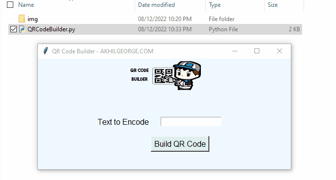

`QR Code Builder` is a utility tool developed using python, to Build QR codes with custom encoded text.

**About QR Code Builder**
---

There are many QR Code generators available online. This is a QR Code you could run on your local machine, to generate the desired QR code at you convinence.

The GUI Interface, is very simple. It consists of a secret Key - which you need to enter the text to be encoded and click on Build.

**Features**
---

1. Generates QR Code
2. Runs on your local machine without any need for internet
3. No databases involved
4. easy set up

**Packages Used**
---

1. [`tkinter`](https://docs.python.org/3/library/tkinter.html)
     + `$ pip install tkinter`
2. [`PIL`](https://www.pythonware.com/products/pil/)
     + `$ pip install PIL`
3.  [`QRCode`](https://www.pythonware.com/products/pil/) 
  + `$ pip install QRCode`

**Installation Options**
---

1. Install the packages with [`pip`](https://pypi.org/)
      + `$ pip install tkinter`
      + `$ pip install PIL`
      + `$ pip install pyperclip`

2. Run the program using python

**How to Contribute**
---

1. Fork it (<https://github.com/akhilgeo/QR-code-Builder-/fork>)
2. Create your feature branch
3. Commit your changes
4. Push to the branch
5. Create a new Pull Request
